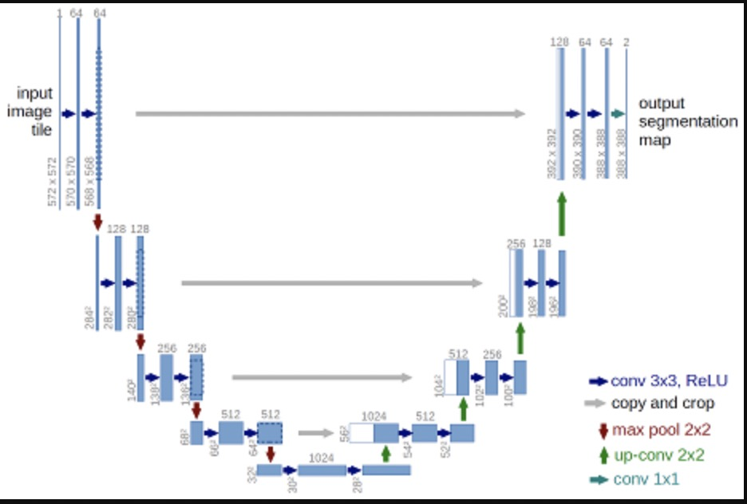

# Implementation of Unet for image segmentation

Reference: [U-Net: Convolutional Networks for Biomedical Image Segmentation](http://lmb.informatik.uni-freiburg.de/people/ronneber/u-net/).

# Model Architecture

