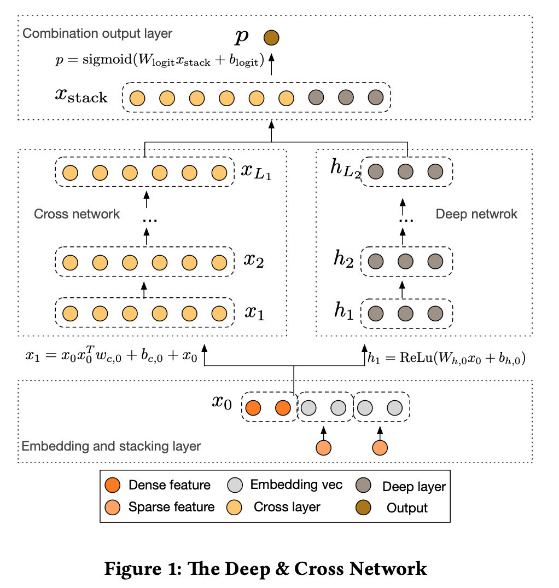

# Deep&Cross 

This is an implementation of Deep&Cross model from [this paper](https://arxiv.org/pdf/1708.05123.pdf)

The main difference between Deep&Cross and Wide&Deep model is the usage of **Cross Layer**.

Overall model architecture:

# Cross Layer

Overall model structure:

The formula of the cross layer from the original paper:

Visulization of the **Cross Layer**:

# Example

Use the [Forest Cover Type](https://www.kaggle.com/uciml/forest-cover-type-dataset/data) data as mentioned in the original paper. `python main.py` to run the example.

# Liscence
MIT
